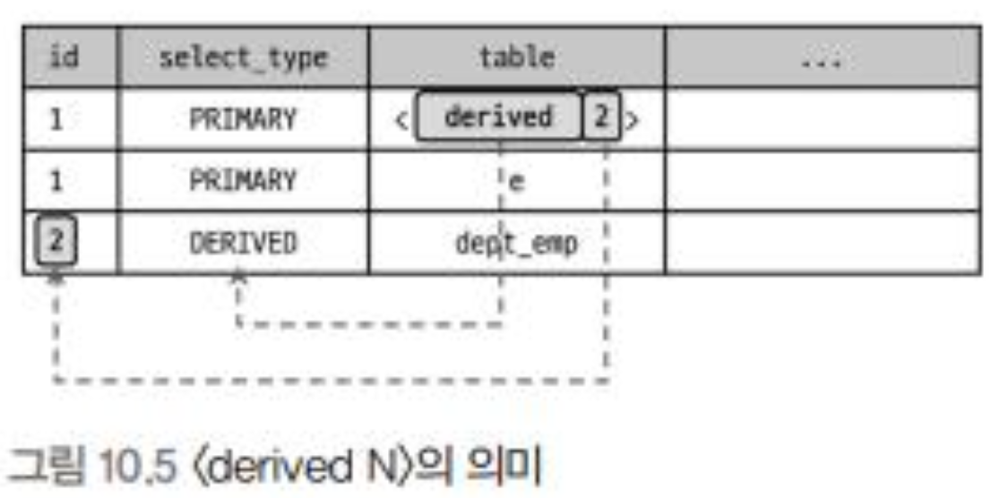
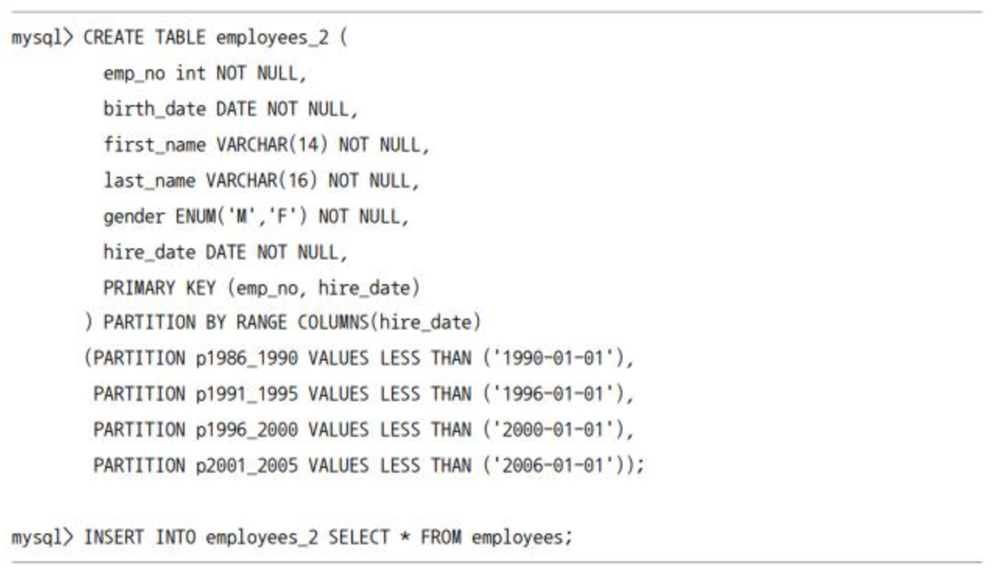
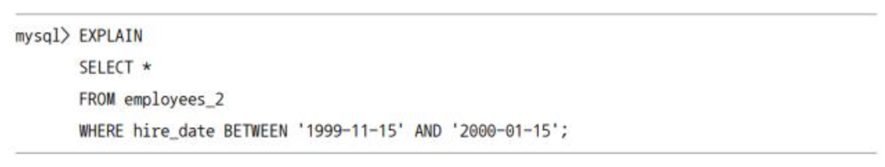
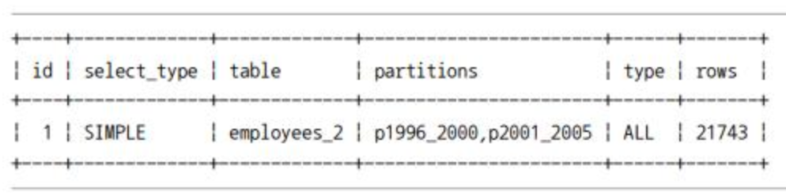
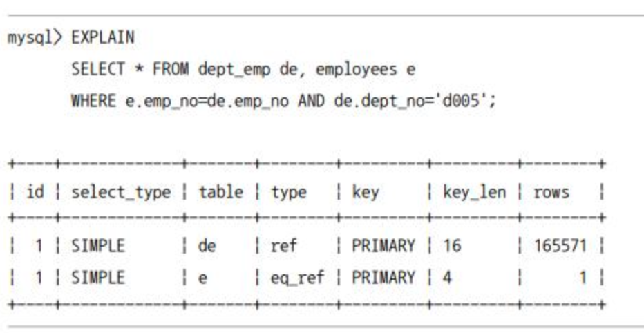
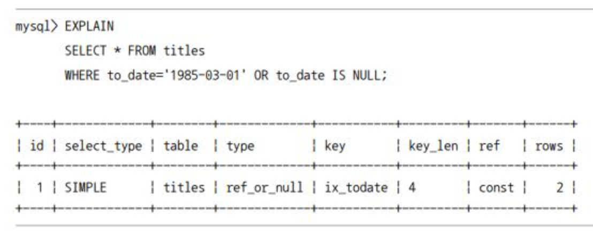
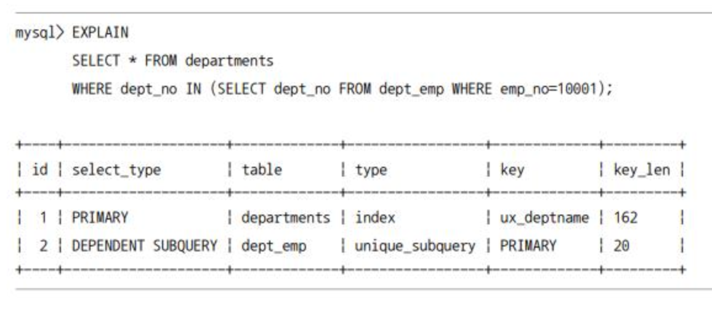
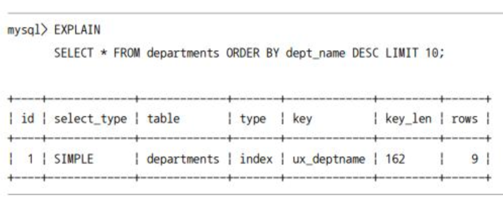
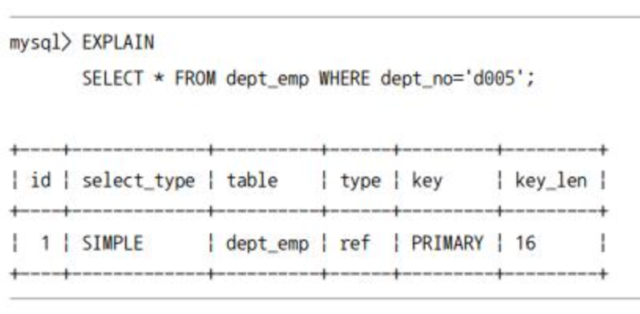
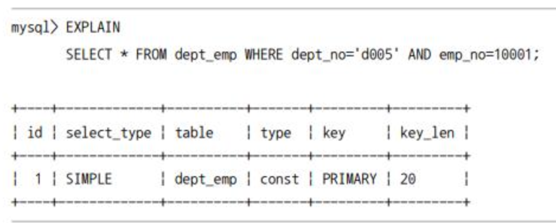

# 10.3 실행 계획 분석

- `EXPLAIN` 명령의 결과로 출력되는 실행 계획이 어떤 접근 방법을 사용하여 최적화를 수행하는지, 그리고 어떤 인덱스를 사용하는지 이해하는 것이 중요하다.
- 표의 각 라인은 쿼리 문장에서 사용된 테이블(서브쿼리로 임시 테이블을 생성한 경우 그 임시 테이블까지 포함)의 개수만큼 출력된다.
- 실행 순서는 위에서 아래로 순서대로 표시된다.
  - 출력된 실행 계획에서 위 쪽에 출력된 결과일수록 쿼리의 바깥(Outer) 부분이거나 먼저 접근한 테이블이고, 아래쪽에 출력된 결과일수록 쿼리의 안쪽(Inner) 부분 또는 나중에 접근한 테이블이다.

## 10.3.1 id 컬럼

- id 칼럼은 단위 `SELECT` 쿼리별로 부여되는 식별자 값이다.
- `SELECT` 문장은 하나인데, 여러 개의 테이블이 조인되는 경우는 id 값이 증가하지 않고 같은 id 값이 부여된다.
  - 실행 계획의 id 칼럼이 테이블의 접근 순서를 의미하지는 않음을 주의하자

## 10.3.2 SELECT TYPE 컬럼

- `SELECT` 쿼리가 어떤 타입의 쿼리인지 표시되는 컬럼

### 10.3.2.1 SIMPLE

- `UNION`이나 서브쿼리를 사용하지 않는 단순한 `SELECT` 쿼리인 경우
- 쿼리 문장이 복잡하더라도 실행 계획에서 `SELECT_TYPE`이 `SIMPLE`인 단위 쿼리는 하나만 존재한다.
- 일반적으로 제일 바깥 `SELECT` 쿼리가 `SIMPLE`로 표시된다.

### 10.3.2.2 PRIMARY

- `UNION`이나 서브쿼리를 가지는 `SELECT` 쿼리의 실행 계획에서 가장 바깥쪽에 있는 단위 쿼리는 `PRIMARY`로 표시된다.

### 10.3.2.3 UNION

- `UNION`으로 결합하는 단위 `SELECT` 쿼리 가운데 첫 번째를 제외한 두 번째 이후 단위 `SELECT` 쿼리는 `UNION`으로 표시된다.

### 10.3.2.4 DEPENDENT UNION

- `UNION` 또는 `UNION ALL`로 결합하는 쿼리가 외부 쿼리에 의해 영향을 받을 때 내부 쿼리에 `DEPENDENT UNION`으로 표시된다.
  - `IN` 절에 `UNION`이 들어있는 경우

### 10.3.2.5 UNION RESULT

- `UNION` 결과를 담아두는 임시 테이블을 가리킨다.

### 10.3.2.6 SUBQUERY

- `FROM`절 이외에서 사용되는 서브쿼리만을 의미한다.
  - `FROM`절에 사용된 서브쿼리는 `SELECT_TYPE`이 `DERIVED`로 표시된다.

### 10.3.2.7 DEPENDENT SUBQUERY

- 서브쿼리가 바깥쪽(OUTER) `SELECT` 쿼리에서 정의된 컬럼을 사용하는 경우 안쪽(INNER) 서브쿼리 결과가 바깥쪽에 의존적이기 때문에 `DEPENDENT`가 붙는다.

### 10.3.2.8 DERIVED

- `FROM`절에서 서브쿼리가 사용되면서 단위 `SELECT` 쿼리의 실행 결과로 메모리나 디스크에 임시 테이블을 생성하는 경우
  - 쿼리를 튜닝하기 위해 실행 계획의 `DERIVED`가 있는지 확인한다. 서브쿼리를 조인으로 해결할 수 있다면 서브쿼리 보다 조인을 권장한다.

### 10.3.2.9 DEPENDENT DERIVED

- `FROM`절 서브쿼리에서 외부 컬럼을 참조할 때 (`LATERAL JOIN` 기능에서만 가능)

### 10.3.2.10 UNCACHABLE SUBQUERY

- 하나의 쿼리 문장에 조건이 똑같은 서브쿼리가 실행될 때는 이전의 실행 결과를 그대로 캐시 공간에 담아두어 재사용한다.
- 그러나 서브쿼리에 포함된 요소에 의해 캐시 자체가 불가능할 수 있는데 이 때 `UNCACHEABLE SUBQUERY`로 표시된다.
  - 사용자 변수가 서브쿼리에 사용된 경우
  - `NOT-DETERMINISTIC` 속성의 스토어드 루틴이 서브쿼리 내에 사용된 경우
  - `UUID()` `RAND()`와 같이 결괏값이 호출할 때 마다 달라지는 함수가 서브쿼리에 사용된 경우

### 10.3.2.11 UNCACHEABLE UNION

- UNCACHEABLE + UNION

### 10.3.2.12 MATERIALIZED

- 서브쿼리의 내용을 임시 테이블로 구체화(Materialization)한 후 임시 테이블을 조인하는 형태로 최적화 하는 경우
  - 서브쿼리 부분이 먼저 처리되어 임시 테이블로 구체화한다는 것을 이 `SELECT_TYPE`으로 알 수 있다.

## 10.3.3 TABLE 컬럼

- MySQL 서버의 실행계획은 단위 `SELECT` 기준이 아니라 테이블 기준으로 표시된다.

```SQL
EXPLAIN SELECT NOW();
EXPLAIN SELECT NOW() FROM DUAL;
```

- 위의 두 예제와 같이 별도의 테이블을 사용하지 않는 `SELECT` 쿼리의 경우 table 컬럼에는 NULL로 표시된다.
  - 실제 DUAL 이라는 테이블은 존재하지 않지만 내부적으로 DUAL이 있는 것처럼 작동한다.
  - 되도록이면 DUAL 예약어는 사용하지 말자. (백틱으로 감싸서 사용해야 한다)
- TABLE 칼럼에 <>로 감싸져 있는 경우에 해당 테이블은 임시 테이블임을 의미한다.
- <> 안에 표시되는 숫자는 `SELECT` 쿼리의 id를 지칭한다.

```SQL
SELECT *
FROM
(SELECT de.emp_no FROM dept_emp de GROUP BY de.emp_no) tb,
employees e
WHERE e.emp_no=tb.emp_no;
```



- 지금까지 살펴본 실행 계획의 id, select_type, table 컬럼은 실행 계획의 각 라인에 명시된 테이블이 어떤 순서로 실행되는지를 판단하는 근거를 표시해준다.
- 위의 실행 계획을 분석해보자
  - 첫 번째 라인의 테이블이 라는 것으로 보아 id 2번 라인이 먼저 실행되고 그 결과가 임시테이블로 준비 되어야 한다.
  - 세 번째 라인에서 select_type이 DERIVED인 것으로 보아 dept_emp 테이블을 읽어서 파생 테이블을 생성함을 알 수 있다.
    - 세 번째 라인에서 생성된 결과를 첫 번째 라인에서 사용한다.
  - 첫 번째라인과 두 번째 라인의 id가 같다는 것은 2개의 테이블이 조인됨을 추측할 수 있고 1번 라인의 테이블이 먼저 표시되었으므로 드라이브 테이블 e가 드리븐 테이블임을 알 수 있다.

## 10.3.4 partitions 컬럼

- MySQL 8.0 버전 부터는 EXPLAIN 명령으로 파티션 관련 실행 계획까지 모두 확인할 수 있다.
- partitions 컬럼을 알아보기 위해 실제로 파티션 테이블을 만들어보고 어떻게 동작하는지 살펴보자



- employees_2 파티션 테이블을 생성한다.
  - hire_date 컬럼 값을 기준으로 5년 단위로 파티션을 나눈다.
  - 파티션 관련 제약 사항: 파티션 키로 사용되는 컬럼은 프라이머리 키를 포함한 모든 유니크 인덱스의 일부여야 한다.
- employee 테이블의 모든 레코드를 복사한다.



- 파티션이 여러 개인 테이블에서 불필요한 파티션을 빼고 쿼리를 수행하기 위해 접근해야 할 것으로 판단되는 테이블만 골라내는 과정을 파티션 프루닝(partitions pruning)이라 한다.
- 파티션을 참조하는 쿼리(파티션 키 칼럼을 where 조건으로 가진)의 경우 옵티마이저가 쿼리 처리를 위해 필요한 파티션들의 목록만 모아서 실행 계획의 partitions 컬럼에 표시해준다.



- 위의 실행 계획에서 type 컬럼 값이 ALL로 표시되어 있는데 이는 풀 테이블 스캔으로 처리 됨을 의미한다.
  - 파티션은 물리적으로 개별 텡디블 저장 공간을 가진다. 따라서 각 파티션의 풀 테이블 스캔을 실행한다.

## 10.3.5 type 컬럼

- MySQL 실행 계획에서 type 이후의 컬럼은 MySQL 서버가 각 테이블의 레코드를 어떤 방식으로 읽었는지를 설명한다.
  - 인덱스를 사용하여 읽었는지 or 풀 테이블 스캔으로 읽었는지
- Type 컬럼은 실행계획에서 각 테이블의 접근 방법을 나타낸다.
  - 인덱스를 효율적으로 사용하는지 확인하기 위해 type 컬럼은 반드시 체크해야 할 중요한 정보다.
- 앞으로 설명할 12개의 접근 방법 중 ALL을 제외한 나머지는 모두 인덱스를 사용하는 접근 방법이다ㅣ.
- ALL은 인덱스를 사용하지 않고, 테이블을 처음부터 끝까지 읽어서 레코드를 가져오는 풀 테이블 스캔 접근 방법을 의미한다.
- 다음의 순서는 성능이 빠른 순서대로 나열된 것이다. 옵티마이저는 이러한 접근 방법과 비용을 계산하여 최소의 비용의 접근 방법을 선택해 쿼리를 처리한다.

### 10.3.5.1 system

- 레코드가 1건 or 한 건도 존재하지 않는 테이블을 참조하는 형태의 접근 방법
- InnoDB 스토리지 엔진에서는 나타나지 않는다.

### 10.3.5.2 const

- 테이블의 레코드 건수와 관계없이 쿼리가 프라이머리 키나 유니크 키 컬럼을 이용하는 WHERE 조건을 가지고 있으며, 반드시 1건을 반환하는 쿼리의 처리 방식을 const라고 한다.
  - 다른 DBMS에서는 유니크 인덱스 스캔이라고도 표현한다.
- 다중 컬럼으로 구성된 프라이머리 키나 유니크 키 중에서 인덱스의 일부 컬럼만 조건으로 사용할 때는 const 타입의 접근 방법을 사용할 수 없다.
- 다음과 같이 프라이머리 키의 일부만 조건으로 사용할 때는 type 컬럼에 const가 아닌 ref로 표시된다.

```SQL
mysql> EXPLAIN
SELECT * FROM dept_emp WHERE dept_no='d005';
```

- 하지만 프라이머리 키나 유니크 인덱스의 모든 컬럼을 and 조건으로 where 절에 명시하면 다시 const 접근 방법을 사용한다.
- 왜 const인가?
  - MySQL 옵티마이저는 const type의 쿼리를 통째로 상수화한다.

### 10.3.5.3 eq_ref

- 여러 테이블이 조인되는 쿼리의 실행 계획에서 조인에서 처음 읽은 테이블의 컬럼 값을, 그 다음 읽어야 할 테이블의 프라이머리 키나 유니크 키 컬럼의 검색 조건에 사용할 때를 eq_ref라고 한다.
  - 두 번째 이후에 읽는 테이블에서 반드시 1건만 존재한다는 보장이 있어야 사용할 수 있는 접근 방법이다.
  - 이 때, 두 번째 이후에 읽는 테이블의 type 컬럼에 eq_ref가 표시된다.
- 다음 예제 쿼리의 실행 계획을 살펴보자
  - 첫 째 라인과 둘 째 라인의 id 값이 1로 같으므로 두 테이블이 조인으로 실행된다.
  - dept_emp 테이블이 위에 있으니 dept_emp 테이블을 먼저 읽고 e.emp_no=de_emp_no 조건을 이용해 employees 테이블을 검색한다.
  - employees 테이블의 키가 emp_no 이므로 두 번째 라인의 type 컬럼이 eq_ref로 표시된다.



### 10.3.5.4 ref

- 인덱스의 종류와 관계 없이 동등 조건으로 검색할 때 ref 접근 방법이 사용된다.
- ref 타입은 반환되는 레코드가 반드시 1건이라는 보장이 없으므로 const나 eq_ref보다는 빠르지 않다. (그래도 빠른 조회 방법 중 하나이다.)

```SQL
EXPLAIN
SELECT * FROM dept_emp WHERE dept_no='d005';
```

- dept_emp 테이블의 프라이머리 키가 (dept_no, emp_no)라 할 때 일부만 동등 조건으로 명시됐기 때문에 조건에 일치하는 레코드가 1건이라는 보장이 없다.
  - 따라서 const 대신 ref 접근 방법이 사용되었다.

### 10.3.5.5 fulltext

- MySQL 서버의 전문 검색 인덱스를 사용해 레코드를 직접 읽는 방식이다.
- 쿼리에서 전문 인덱스를 사용하는 조건과 그 이외의 일반 인덱스를 사용하는 조건을 함께 사용하면 일반 인덱스의 접근 방법이 const, eq_ref, ref가 아니면 일반적으로 MySQL 옵티마이저는 전문 인덱스를 사용하는 조건을 선택한다.

### 10.3.5.6 ref_or_null

- ref 접근 방법과 같은데, NULL 비교가 추가된 형태이다.
- 접근 방법의 이름 그대로 ref 방식 또는 NULL 비교(IS NULL) 접근 방법을 의미한다.



### 10.3.5.7 unique_subquery

- WHERE 조건절에서 사용되는 IN(subquery) 형태의 쿼리를 위한 접근 방법이다.
  - unique_subquery 의미 그대로 중복되지 않는 유니크한 값만 반환할 때 이 접근 방법을 사용한다.



### 10.3.5.8 index_subquery

- IN(subquery) 또는 IN (상수 나열) 형태의 조건에서 중복된 값이 있을 수 있지만 인덱스를 이용해 중복된 값을 제거할 수 있을 때 이 접근 방법을 사용한다.
  - 위의 unique_subquery 와의 차이는 중복된 값이 있는지 여부이다.

### 10.3.5.9 range

- 인덱스 레인지 스캔 형태의 접근 방법이다.
- range는 인덱스를 하나의 값ㄷ이 아니라 범위로 검색하는 경우를 의미한다. 주로 "<, >, IS NULL, BETWEEN, IN, LIKE" 등의 연산자를 이용해 인덱스를 검색할 때 사용된다.
- range 접근 방법도 상당히 빠르고 최적의 성능이 보장된다고 볼 수 있다.


### 10.3.5.10 index_merge

- 2개 이상의 인덱스를 이용해 각각의 검색 결과를 만들어낸 후, 그 결과를 병합해서 처리하는 방식
- 특징
  - 여러 인덱스를 읽어야 하므로 일반적으로 range 접근 방법보다 효율성이 떨어진다.
  - 전문 검색 인덱스를 사용하는 쿼리에서는 index_merge가 적용되지 않는다.
  - index_merge 접근 방법으로 처리된 결과는 항상 2개 이상의 집합이 되기 때문에 그 두 집합의 교집합이나 합집합, 또는 중복 제거와 같은 부가적인 작업이 더 필요하다.


### 10.3.5.11 index

- index 접근 방법은 인덱스를 처음부터 끝까지 읽는 인덱스 풀 스캔을 의미한다.
- 풀 테이블 스캔 방식과 비교했을 때 비교하는 레코드 건수는 같지만 인덱스의 크기가 작으므로 풀 테이블 스캔보다 빠르게 처리되며, 정렬된 인덱스의 장점을 활용할 수 있어서 효율적이다.



### 10.3.5.12 ALL

- 풀 테이블 스캔을 의미하는 접근 방법이다.
  - 가장 마지막에 선택하는 가장 비효율적인 방법
- 풀 테이블 스캔이나 인덱스 풀 스캔 시 한꺼번에 많은 페이지를 읽어 들이는 리드 어헤드(Read Ahead) 기능을 제공한다.
- 일반적으로 index와 ALL 접근 방법은 작업 범위를 제한하는 조건이 아니므로 빠른 응답을 보내는 웹 서비스나 온라인 트랜잭션 처리 환경에는 적합하지 않다.

## 10.3.6 possible_keys 컬럼

- 옵티마이저가 최적의 실행 계획을 만들기 위해 후보로 선정했던 인덱스의 목록이다.
- 실제 실행 계획에서 이 컬럼에 모든 인덱스가 포함되는 경우가 많아서 크게 도움이 되지 않는 컬럼이다.
  - 무시해도 좋다.
  - 이 칼럼에 나온다고 인덱스를 사용했다고 판단하지 말자.

## 10.3.7 key 컬럼

- key 컬럼에 표시되는 인덱스는 최종 선택된 실행 계획에서 사용하는 인덱스이다.
- 쿼리를 튜닝할 때는 이 칼럼에 의도했던 인덱스가 나오는지 확인하는 것이 중요하다.
  - PRIMARY 또는 인덱스 이름으로 표시된다.

## 10.3.8 key_len 컬럼

- 다중 컬럼으로 만들어진 인덱스에서 쿼리를 처리하기 위해 몇 개의 컬럼이 사용됐는지를 판단할 때 사용되는 컬럼이다.
  - 때문에 중요한 컬럼 중 하나이다.
  - 바이트 단위로 표시된다.



- 위의 쿼리에서 프라이머리 키는 (dept_no, emp_no)로 구성된다.
- dept_no 컬럼의 타입 CHAR(4)이기 때문에 프라이머리 키에서 앞쪽 16바이트만 유효하게 사용했다는 의미이다.
  - utf8mb4 문자 집합에서 문자 하나가 차지하는 공간이 1 - 4 바이트로 가변적이지만 MySQL 서버에서 메모리 공간을 할당해야 할 때는 고정 4바이트로 계산한다.
  - 따라서 16바이트가 표시되었다.



- 위의 쿼리는 dept_no와 emp_no 각각의 조건을 가지고 있다.
- dept_emp 테이블의 emp_no 컬럼 타입이 INTEGER 일 때 4바이트를 차지하므로 위의 쿼리는 dept_no, emp_no를 사용함을 알 수 있다.

## 10.3.9 ref 컬럼

- 접근 방법이 ref, eq_ref일 때 참조 조건(Where 절의 동등 비교)으로 어떤 값이 제공됐는지 보여준다.
  - 크게 신경쓰지 않아도 되는 컬럼
- 위의 실행 계획에서 ref 컬럼이 조인 대상 컬럼의 이름으로 나오는 것을 볼 수 있다.
- 다만 조인 조건에 산술 표현식을 넣으면 ref 값이 조인 컬럼 이름이 아닌 func라고 표시될 수 있다.
- 위의 쿼리처럼 명시적으로 값을 변환할 때뿐만 아니라 MySQL 서버가 내부적으로 값을 변환해야할 때도 ref 컬럼에는 func가 출력된다.
  - 숫자 타입의 컬럼과 문자열 타입을 조인하는 경우 등
  - 이러한 변환을 하지 않도록 조인 컬럼의 타입을 일치시키는 편이 좋다.

## 10.3.10 rows 컬럼

- MySQL 옵티마이저는 가능한 처리 방식이 얼마나 많은 레코드를 읽고 비교해야 하는지 예측해서 비용을 산정한다.
- rows 컬럼값은 실행 계획의 효율성 판단을 위해 예측했던 레코드 건수를 보여준다.
  - 이 값은 통계 정보를 참조해 효율성 판단을 위해 예측했던 레코드 건수를 보여준다.
  - 이 값은 반환하는 레코드를 예측한 수가 아니라 쿼리를 처리하기 위해 체크한 레코드 수를 의미한다.
  - 그래서 실행 계획의 rows 컬럼에 출력되는 값과 실제 쿼리 결과 반환된 레코드 건수는 일치하지 않는 경우가 많다.

## 10.3.11 filtered 컬럼

- 각 테이블에서 일차하는 레코드 개수를 가능하면 정확히 파악해야 더 효율적인 실행계획을 수립할 수 있다.
- 특히나 조인을 사용할 때 일치하는 레코드 수가 적은 테이블이 드라이빙 테이블로 선정되어야 하는데 이 때 rows 컬럼 \* filtered 컬럼의 결과로 비교한다.
  - filtered 컬럼 값은 필터링되고 남은 레코드의 비율을 의미한다.

## 10.3.12 Extra 컬럼

- Extra 컬럼에는 성능에 관련된 중요한 내용이 자주 표시된다.
- 내부적인 처리 알고리즘에 대해 조금 더 깊이있는 내용을 보여주는 경우가 많다.

### 10.3.12.1 const row not found

- const 접근 방법으로 테이블을 읽었지만 실제로 해당 테이블에 레코드가 1건도 존재하지 않을 때 표시된다.

### 10.3.12.2 Deleting all rows

- Where 조건절이 없는 DELETE 문장의 실행 계획에서 자주 표시된다.

### 10.3.12.3 Distinct

- 다음과 같이 Distinct 키워드를 사용하였을 때 표시된다.

### 10.3.12.4 FirstMatch

- 세미 조인의 FirstMatch 전략을 사용한다면 FirstMatch(table_name) 메시지를 출력한다.
- 함께 표시되는 테이블명은 기준 테이블을 의미한다.

### 10.3.12.5 Full scan on NULL key

- col1 IN (SELECT col2 FROM ...)과 같은 조건을 가진 쿼리에서 col1의 값이 NULL이 되면 표시된다.

### 10.3.12.6 Impossible Having

- Having절의 조건을 만족하는 레코드가 없을 때
  - 쿼리 점검 요망

### 10.3.12.7 Impossible Where

- Where 조건이 항상 FALSE가 될 수밖에 없을 때

### 10.3.12.8 LooseScan

- 세미 조인의 LooseScan 최적화 전략이 사용될 때

### 10.3.12.9 No matching min/max row

- MIN()이나 MAX()와 같은 집합 함수가 있는 쿼리의 조건절에 일치하는 레코드가 한 건도 없을 때

### 10.3.12.10 No matching row in const table

- 조인에 사용된 테이블에서 const 방법으로 접근할 때 일치하는 레코드가 없는 경우

### 10.3.12.11 No matching rows after partition pruning

- 해당 파티션에서 UPDATE 하거나 DELETE 할 대상 레코드가 없을 때

### 10.3.12.12 No tables used

- FROM 절이 없는 쿼리 문장이나 FROM DUAL 형태의 쿼리를 실행할 경우

### 10.3.12.13 Not exists

- A 테이블에는 존재하지만 B 테이블에는 없는 값을 조회해야 하는 경우
  - 주로 NOT IN(subquery) 형태나 NOT EXISTS 연산자를 사용한다.
- 이를 outer 조인으로 처리하면 빠른 성능을 낼 수 있다. (쿼리가 어려움)
  - outer 조인을 이용해서 안티 조인을 수행하는 쿼리에서 Not exists 메시지가 표시된다.

### 10.3.12.14 Plan isn't ready yet

- 다른 커넥션에서 실행 중인 쿼리의 실행 계획을 살펴볼 때 쿼리의 실행 계획을 수립하지 못한 상태에서 조회 시에 위와 같이 표시된다.

### 10.3.12.15 Range checked for each record(index map: N)

- 레코드마다 인덱스 레인지 스캔을 하게 되는 경우
  - 괄호 안의 index map: N은 인덱스를 사용할지 말지 판단하게 되는 인덱스를 의미한다.

### 10.3.12.16 Recursive

- 재귀 쿼리

### 10.3.12.17 Rematerialize

- 레터럴 조인으로 조인되는 테이블은 선행 테이블의 레코드별로 서브쿼리를 실행해서 그 결과를 임시 테이블에 저장한다. (Rematerializing)

### 10.3.12.18 Select tables optimized away

- MIN() 또는 MAX() 만 SELECT 절에 사용되거나 GROUP BY로 MIN(), MAX()를 조회하는 쿼리가 인덱스를 오름차순 또는 내림차순으로 1건만 읽는 최적화가 적용될 때

```SQL
SELECT MAX(emp_no), MIN(emp_no) FROM employees;

SELECT MAX(from_date), MIN(from_date) FROM salaries WHERE emp_no=10002;
```

### 10.3.12.19 Start temporary, End Temporary

- 세미 조인 최적화 중에서 Duplicate Weed-out 최적화 전략이 사용될 때

```SQL
SELECT * FROM employees e
WHERE e.emp_no IN (SELECT s.emp_no FROM salaries s WHERE s.salary > 150000);
```

### 10.3.12.20 unique row not found

- 두 개의 테이블이 각각 유니크 컬럼으로 아우터 조인을 수행하는 쿼리에서 아우터 테이블에 일치하는 레코드가 존재하지 않을 때

### 10.3.12.21 Using filesort

- Order by 처리를 인덱스로 할 수 없을 때 레코드를 조회하고 메모리 버퍼에 복사해 정렬을 하게된다.

### 10.3.12.22 Using Index(커버링 인덱스)

- 인덱스만 읽어서 쿼리를 모두 처리할 수 있을 때

### 10.3.12.23 Using Index Condition

- 인덱스 컨디션 푸시 다운 최적화를 사용할 때

### 10.3.12.24 Using Index for Group-by

- 타이트 인덱스 스캔을 통한 GROUP BY 처리
- 루즈 인덱스 스캔을 통한 GROUP BY 처리

### 10.3.12.25 Using Index for Skip Scan

- 인덱스 스킵 스캔 최적화를 사용할 때

### 10.3.12.26 Using join buffer(Block Nested Loop), Using join buffer(Batched Key Access), Using join buffer(hash join)

- MySQL 옵티마이저는 조인되는 두 테이블에 있는 각 컬럼에서 인덱스를 조사하고 인덱스가 없는 테이블이 있으면 그 테이블을 먼저 읽어서 조인을 실행한다.
  - 드리븐 테이블의 조인 컬럼에 적절한 인덱스가 없다면 서버는 블록 네스티드 루프 조인이나 해시 조인을 사용한다.

### 10.3.12.27 Using MRR

- MySQL 엔진은 여러 개의 키 값을 한 번에 스토리지 엔진으로 전달하고, 스토리지 엔진은 넘겨받은 키 값들을 정렬해서 최소한의 페이지 접근만으로 필요한 레코드를 읽을 수 있게 최적화한다.

### 10.3.12.28 Using sort_union, Using union, Using intersect

- index_merge 접근 방법으로 실행되는 경우 두 개의 인덱스를 어떻게 병합했는지를 표시한다.
  - sort_union: PK만 먼저 읽어 정렬하고 병합한다.

### 10.3.12.29 Using temporary

- MySQL 서버에서 쿼리를 처리할 때 중간 결과를 담아 두기 위해 임시 테이블을 생성하는 경우 표시된다.
  - 메모리 or 디스크에 생성되는데 실행 계획만으로는 알 수 없다.

### 10.3.12.30 Using Where

- MySQL 스토리지 엔진에서 얻어온 레코드를 MySQL 엔진에서 별도로 가공하는 경우에만 Using Where 코멘트가 표시된다.

### 10.3.12.31 Zero Limit

- MySQL 서버에서 데이터 값이 아닌 쿼리 결괏값의 메타데이터만 필요한 경우 쿼리 마지막에 LIMIT 0을 사용하면 된다.
- 옵티마이저도 이러한 사용자의 의도를 알아채고 레코드를 읽지 않고 메타정보만 반환한다.
- 이때, Zero Limit 메시지가 출력된다.
