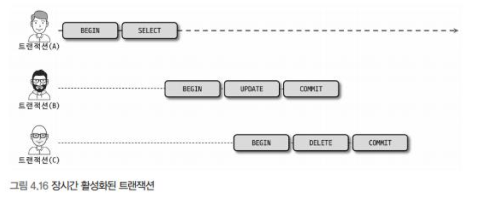
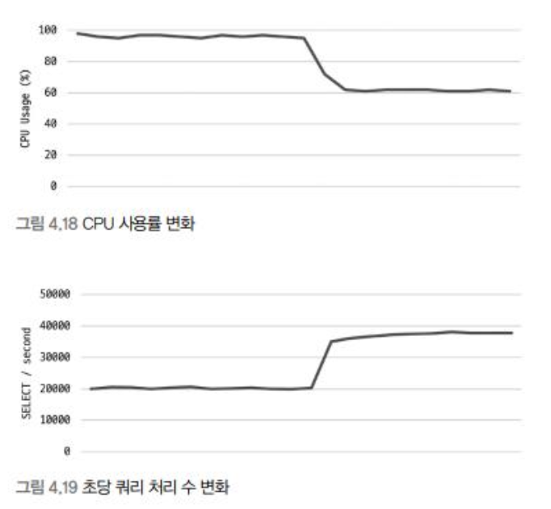

## 언두 로그

InnoDB는 트랜잭션과 격리 수준을 보장하기 위해 DML(`INSERT`, `UPDATE`, `DELETE`)로 변경되기 이전 버전의 데이터를 별도로 백업하는데, 이를 **언두 로그**라고 한다.

언두 로그는 다음과 같이 사용된다.

- 트랜잭션 보장
  - 트랜잭션이 롤백되면 트랜잭션 도중 변경된 데이터를 변경 전 데이터로 복구해야 하는데, 이때 **언두 로그에 백업해둔 이전 버전의 데이터를 이용해 복구**한다.
- 격리 수준 보장
  - 특정 커넥션에서 데이터를 변경하는 도중 다른 커넥션에서 데이터를 조회하면 트랜잭션 격리 수준에 맞게 **변경 중인 레코드를 읽지 않고 언두 로그에 백업해둔 데이터를 읽어서 반환**하기도 한다.

언두 로그는 관리 비용도 많이 필요한데, 언두 로그가 어떤 문제점을 가지고 있고, 이를 위해 InnoDB 스토리지 엔진이 어떤 기능을 제공하는지 이번 장에서 살펴본다.

### 4.2.9.1 언두 로그 레코드 모니터링

언두 영역은 DML로 데이터를 변경했을 때 변경되기 전의 데이터를 보관하는 곳이다.

```SQL
UPDATE member SET name='홍길동' WHERE member_id=1;
```

위 SQL 문장이 실행되면 트랜잭션을 커밋하지 않아도 실제 데이터 파일 내용은 '홍길동'으로 변경된다. 그리고 변경되지 전의 값이 '벽계수'였다면, 언두 영역에는 '벽계수'라는 값이 백업되는 것이다.

언두 로그의 데이터는 크게 두 가지 용도로 사용된다.

- 트랜잭션의 롤백 대용
- 트랜잭션의 격리 수준을 유지면서 높은 동시성을 제공

#### 언두 로그 공간

MySQL 5.5 이전 버전에서는 **한 번 증가한 언두 로그 공간은 다시 줄어들지 않음.** 언두 로그의 양이 증가하는 경우는 아래 두 가지가 있다.

- 대용량의 데이터를 변경하는 경우
- 트랜잭션이 오랜 시간 동안 지속되는 경우
  - 트랜잭션이 완료되었다고 해서, **해당 트랜잭션이 생성한 언두 로그를 즉시 삭제할 수 있는 것이 아니다**.
    
  - 이런 식으로 언두 로그가 쌓이게 되면, InnoDB는 조회시에 언두 로그를 계속 살펴야하고 **쿼리의 성능이 전반적으로 하락**하게 된다.

MySQL 8.0 부터는 언두 로그 공간을 필요한 시점에 사용 공간을 줄여주기도 하여, 이러한 문제는 어느 정도 해결되었다.

### 4.2.9.2 언두 테이블스페이스 관리

언두 로그가 저장되는 공간을 **언두 테이블스페이스**라고 한다. 8.0 버전 부터는 언두 로그는 항상 시스템 테이블스페이스 외부의 별도 로그 파일에 기록되도록 개선되었다.

```Text
최대 동시 트랜잭션 수 = (InnoDB 페이지 크기) / 16 * (롤백 세그먼트 개수) * (언두 테이블스페이스 개수)
```

언두 테이블스페이스 공간을 필요한 만큼만 남기고 할당된 공간을 운영체제로 반납하는 것을 `Undo tablespace truncate`라고 한다.

## 4.2.10 체인지 버퍼

RDBMS의 데이터가 변경될 때, 데이터 파일을 변경하는 것 만큼 **인덱스를 업데이트하는 것도 중요**하다.

InnoDB는 변경해야 할 인덱스 페이지가 버퍼 풀에 있으면 바로 업데이트를 수행하지만 디스크로 부터 읽어와야 한다면, 이를 임시 공간에 저장해 두고 바로 사용자에게 결과를 반환하는 형태로 성능을 향상시킨다. 이 때 사용하는 임시 공간을 **체인지 버퍼**라고 한다.

유니크 인덱스는 반드시 중복 여부를 검사해야하기 때문에 체인지 버퍼를 사용할 수 없다.

체인지 버퍼에 저장된 인덱스 레코드 조각은 이후 백그라운드 스레드에 의해 병합되는데, 이 스레드를 **체인지 버퍼 머지 스레드**라고 한다.

체인지 버퍼는 버퍼 풀의 25%까지 사용할 수 있게 설정되어 있지만, 설정으로 최대 50%까지 사용하게 만들 수 있다.

## 4.2.11 리두 로그 및 로그 버퍼

리두 로그는 ACID의 **D(Durable, 영속성)** 와 가장 밀접하게 연결되어 있다. 리두 로그는 하드웨어나 소프트웨어 등 여러 가지 문제로 인해 서버가 비정상적으로 종료됐을 때 데이터를 잃지 않게 해주는 안전 장치이다.

대부분의 데이터베이스 서버는 데이터 변경 내용을 로그로 먼저 기록(WAL, Write Ahead Log)한다. 거의 모든 데이터베이스는 **쓰기보다 읽기 성능을 고려한 자료 구조를 가지고 있다**. 그래서 변경된 데이터를 데이터 파일에 기록하는 것은 큰 비용을 요한다. 이러한 성능 저하를 막기 위해 데이터베이스는 **쓰기 비용이 낮은 자료 구조를 가진 리두 로그를 가지고 있다**.

데이터베이스는 ACID뿐만 아니라 성능 역시 중요하기 때문에, 리두 로그를 버퍼링할 수 있는 로그 버퍼와 같은 자료 구조도 가지고 있다.

MySQL 서버가 비정상 종료되는 경우 두 가지 일관되지 않은 데이터를 가질 수 있다.

1. 커밋됐지만, 데이터 파일에 기록되지 않은 데이터
   - 리두 로그를 통해 복구가 가능하다.
2. 롤백됐지만, 데이터 파일에 이미 기록된 데이터
   - 리두 로그만으로는 복구가 불가능하다.

리두 로그는 트랜잭션이 커밋되면 즉시 디스크로 기록되도록 설정하는 것을 권장한다. 그래야만, 서버가 비정상 종료되었을 때 직전의 기록을 통해 복구가 가능해진다.

하지만, 이처럼 커밋마다 디스크에 로그를 작성하는 일은 많은 부하를 유발한다. 그래서 InnoDB에서는 리두 로그를 **어느 주기로 디스크로 동기화할지** 결정하는 시스템 변수를 제공한다.

`innodb_flush_log_at_trx_commit` 변수는 값에 따라 동작이 다르다.

- 0: 1초에 한 번 리두 로그를 디스크로 기록하고 동기화 실행
- 1: 커밋마다 리두 로그를 디스크에 작성
- 2: 커밋마다 리두 로그를 디스크에 작성하지만, 동기화는 1초에 한 번 진행된다.

리두 로그 파일들의 전체 크기는 버퍼 풀의 효율성을 결정하기 때문에 신중히 결정되어야 한다. 리두 로그 파일의 전체 크기가 InnoDB 버퍼 풀의 크기에 맞게 적절히 선택돼야 InnoDB 스토리지 엔진이 적절히 변경된 내용을 버퍼 풀에 모았다가 한 번에 디스크에 기록할 수 있다.

하지만, 변경 작업이 매우 많은 서버의 경우 리두 로그의 기록 작업이 큰 문제가 되는데, 이러한 부분을 보완하기 위해 최대한 ACID 속성을 보장하는 수준에서 버퍼링한다. 이 때 리두 로그 버퍼링에 사용되는 공간이 **로그 버퍼**이다.

### 4.2.11.1 리두 로그 아카이빙

리두 로그를 아카이빙할 수 있는 기능이 8.0에 추가되었다. (나중에 다시 읽어볼게요)

### 4.2.11.2 리두 로그 활성화 및 비활성화

리두 로그는 항상 활성화되어 있는 상태이다. 8.0부터는 리두 로그를 비활성화할 수 있는 기능이 추가되었는데, **대용량의 데이터를 한번에 적재하는 경우 리두 로깅을 비활성화하여 적재 시간을 단축**시킬 수 있다.

해당 작업이 끝난다면, 리두 로그를 다시 활성화해주자.

> [!Question]
>
> ### 리두 로그를 비활성화 했을 때의 문제점
>
> #### 꼬리1. 리두 로그를 비활성화한 상태에서 비정상 종료가 발생하면?

## 4.2.12 어댑티브 해시 인덱스

보통 우리가 인덱스라고 생각하는 것은 B-Tree로 대변되는 우리가 테이블에 수동으로 설정하는 인덱스를 의미. 하지만 `어댑티브 해시 인덱스`는 사용자가 수동으로 생성하는 인덱스가 아니라 InnoDB 스토리지 엔진에서 **사용자가 자주 요청하는 데이터에 대해 자동으로 생성하는 인덱스**

B-Tree는 충분히 빠른 퍼포먼스를 보이지만, O(logN)이라는 시간 복잡도를 가진다. 이는 상대적인 것으로 **어댑티브 해시 인덱스의 경우 데이터를 O(1)의 속도로 검색**할 수 있다.

어댑티브 해시 인덱스의 성능 효과


어댑티브 해시 인덱스는 하나의 메모리 객체로 이에 대한 경합이 많이 발생하였는데 8.0에선 파티셔닝하여 경합을 감소시켰다.

하지만, 어댑티브 해시 인덱스가 팔방미인은 아닌데 아래의 경우 크게 도움이 되지 않는다.

- 디스크 읽기가 많은 경우
- 특정 패턴의 쿼리가 많은 경우(조인이나 LIKE 쿼리)
- 매우 큰 데이터를 가진 테이블의 레코드를 폭넓게 읽는 경우

반대로 아래의 경우 큰 효과를 볼 수 있다

- 디스크의 데이터가 InnoDB 버퍼 풀 크기가 비슷한 경우
- 동등 조건 검색이 많은 경우
- 쿼리가 데이터 중에서 일부 데이터만 집중되는 경우

## 4.2.13 InnoDB와 MyISAM, MEMORY 스토리지 엔진 비교

8.0 버전에서는 InnoDB 밖에 못쓴다고 합니다.. MEMORY 엔진의 경우에도 모든 처리를 메모리에서만 해서 빠를 수도 있다고 오해할 수 있으나, 다중 동시 처리에서는 InnoDB가 더 빠르다고 합니다.

또한, TempTable 엔진이 8.0에서 부터 임시 테이블 용도로 사용되는데 MEMORY 엔진을 사용할 수는 있지만 곧 Deprecate 예정이라고 합니다.
