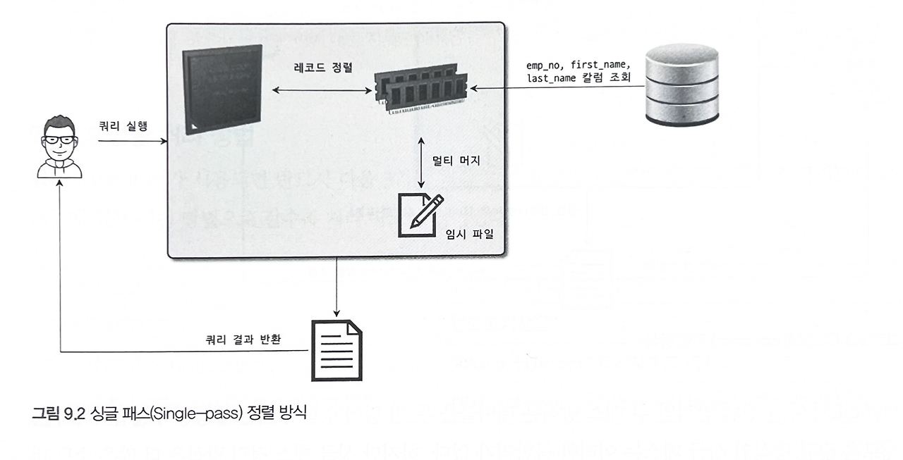
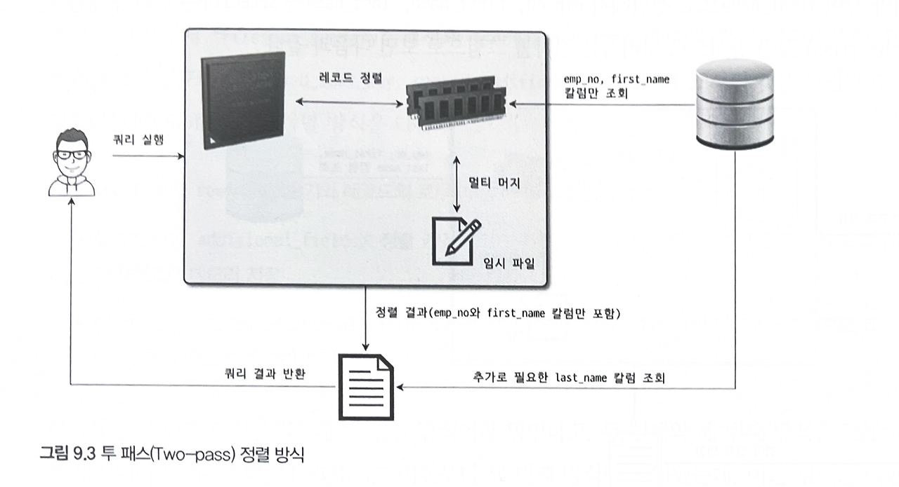
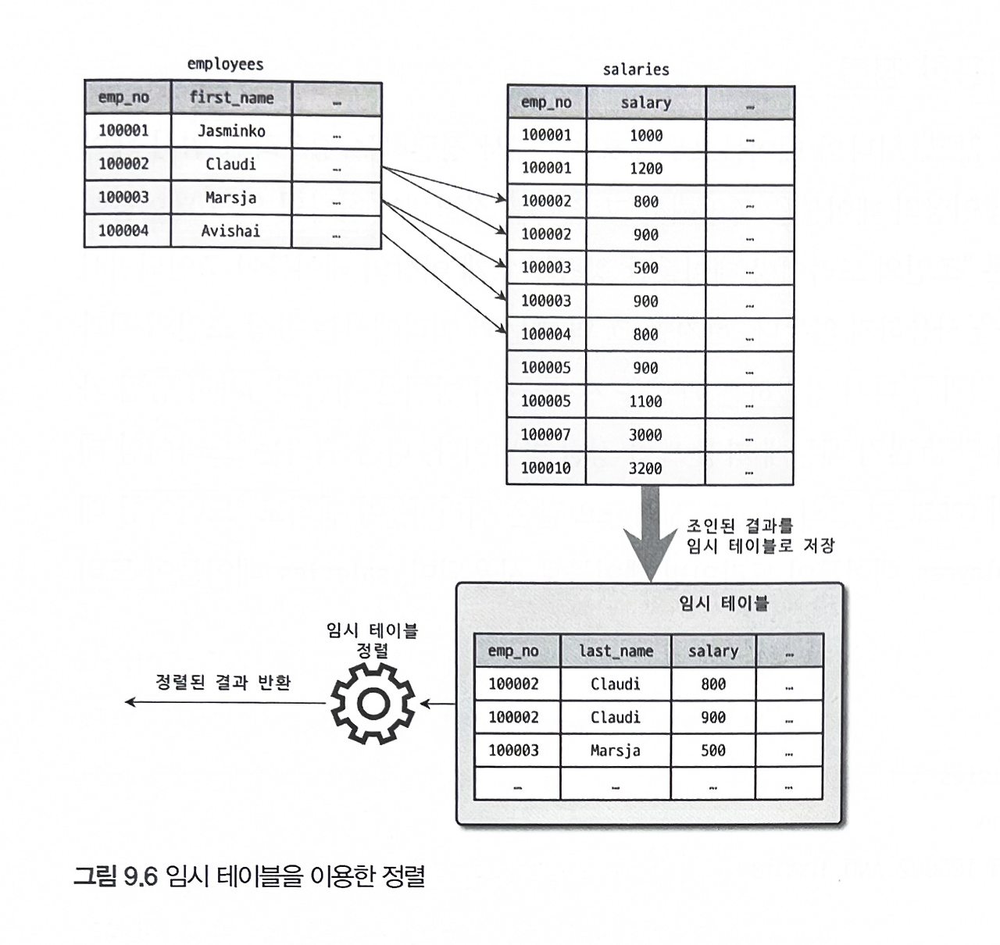

# 9.2 기본 데이터 처리

## 9.2.1 풀 테이블 스캔과 풀 인덱스 스캔

### 풀 테이블 스캔

옵티마이저는 주로 다음 조건에서 풀 테이블 스캔을 선택한다.

- 테이블의 레코드 건수가 너무 적어 인덱스보다 풀 테이블 스캔이 빠를 경우
- WHERE 절이나 ON 절에 인덱스를 이용할 수 있는 적절한 조건이 없는 경우
- 인덱스 레인지 스캔을 사용할 수 있는 쿼리라도 옵티마이저가 판단한 조건 일치 레코드 건수가 너무 많은 경우

MySQL의 InnoDB 에서도 풀 테이블 스캔 시 한 번에 여러 페이지를 읽어올 수 있기에 꽤 빠른 처리가 가능하다.

```sql
SELECT COUNT(*) FROM users
```

위 같은 쿼리는 풀 테이블 스캔보다는 풀 인덱스 스캔이 훨씬 적은 비용이기에 해당 방법을 사용할 것이다.

## 9.2.2 병렬 처리

하나의 쿼리를 여러 스레드가 작업을 나누어 동시에 처리하는 것이다.
실제 병렬 처리용 스레드가 늘어날수록 쿼리 처리에 걸리는 시간이 줄어드는 것을 확인할 수 있다.

## 9.2.3 ORDER BY 처리(Using filesort)

대부분 정렬은 필수적으로 사용된다. 처리 방법은 인덱스를 이용하는 방법과 Filesort 라는 별도의 처리를 이용하는 방법이 있다.

### 인덱스를 이용하는 방법

**장점**

- INSERT, UPDATE, DELETE 쿼리가 실행될 때 이미 인덱스가 정렬되어 있어 순서대로 읽기만 하면 된다.

**단점**

- INSERT, UPDATE, DELETE 작업 시 부가적인 인덱스 추가/삭제 작업이 필요하기에 느리다.
- 인덱스 때문에 디스크 공간이 더 많이 필요하다.
- 인덱스의 개수가 늘어날수록 InnoDB 의 버퍼 풀을 위한 메모리가 많이 필요하다.

### Filesort를 이용하는 방법

**장점**

- 인덱스를 사용하지 않아도 된다.
- 정렬할 레코드가 많지 않으면 메모리에서 처리되므로 충분히 빠르다.

**단점**

- 정렬 작업이 쿼리 실행 시 처리되므로 레코드 대상 건수가 많아질수록 쿼리의 응답 속도가 느리다.

모든 정렬을 인덱스를 이용하기에는 무리가 있다. 특히 아래같은 이유가 존재한다.

- 정렬 기준이 너무 많아 요건 별 모든 인덱스 생성이 불가능
- GROUP BY의 결과 또는 DISTINCT 같은 처리의 결과를 정렬할 경우
- UNION 의 결과와 같이 임시 테이블의 결과를 다시 정렬해야 하는 경우
- 랜덤하게 결과 레코드를 가져와야 하는 경우

### 9.2.3.1 소트 버퍼

MySQL은 정렬을 수행하기 위해 별도의 메모리 공간을 할당 받아 사용하는데 이를 **소트 버퍼**라고 한다. 소트 버퍼는 정렬이 필요한 경우에만 할당되며 크기는 가변적이며 완료시 즉시 반납된다.

만약 정렬한 데이터가 많다면 레코드를 여러 조각으로 나눠 처리하는데 이 과정에서 임시 저장을 위해 디스크를 사용한다. 메모리를 통한 정렬을 수행하고 그 결과를 임시로 디스크에 저장한다. 각 버퍼 크기만큼 정렬된 레코드를 다시 병합하면서 정렬을 수행한다. 이 병합 작업을 **멀티 머지**라 한다.

레코드 건수가 많을 수록 디스크 IO가 많아진다. 소트 버퍼의 크기가 커지면 무조건 빨라질 것 같지만 아니다. 일반적으로는 56KB에서 1MB 미만이 적절하다. 소트 버퍼의 크기가 너무 크면 서버의 메모리가 부족해질 수 있다.

### 9.2.3.2 정렬 알고리즘

레코드 정렬 시 전체를 담을지 또는 정렬 기준 칼럼만 담을지에 따라 `싱글 패스`와 `투 패스` 2가지 정렬 모드로 나눌 수 있다. 어떤 모드인지는 옵티마이저 옵션을 통해 확인 가능하다.

#### 싱글 패스 정렬

소트 버퍼에 정렬 기준 칼럼을 포함해 모든 칼럼을 담아 정렬하는 방식이다. 처음 테이블을 읽을 때 모든 칼럼을 읽어 소트 버퍼에 담는다. 정렬이 완료되면 정렬 버퍼의 내용을 그대로 클라이언트에 넘겨준다.


#### 투 패스 정렬

정렬 대상 컬럼과 프라이머리 키 값만 소트 버퍼에 담아 정렬 후 다시 프라이머리 키로 테이블을 읽어 컬럼을 가져오는 방식이다.


투 패스는 테이블을 두 번 읽어야 하기에 불합리하지만, 하지만 싱글 패스의 경우에도 많은 소트 버퍼 공간이 필요하다는 단점이 있다.

최신 버전에서는 일반적으로 **싱글 패스 방식을 주로 사용**한다.

### 9.2.3.3 정렬 처리 방법

쿼리에 ORDER BY가 사용되면 반드시 3가지 처리 방법 중 하나로 정렬된다.

- 인덱스를 사용한 정렬
- 조인에서 드라이빙 테이블만 정렬: "Using filesort" 메시지가 표시
- 조인에서 조인 결과를 임시 테이블로 저장 후 정렬: "Using temporary; Using filesort" 메시지가 표시

옵티마이저는 우선 인덱스 이용 여부를 확인한다. 만약 사용할 수 없다면 Filesort 과정을 거치는데, 이는 WHERE 조건에 일치하는 레코드를 검색해 정렬 버퍼에 저장하면서 정렬을 처리하는 방식이다. 이 때 정렬 대상 레코드를 최소화 하기 위해 2가지 방법 중 하나를 선택한다.

- 조인의 드라이빙 테이블만 정리 후 조인
- 조인이 끝나고 일치하는 레코드를 모두 가져온 후 정렬

#### 9.2.3.3.1 인덱스를 이용한 정렬

반드시 `ORDER BY` 에 명시된 칼럼이 제일 먼저 읽는 테이블에 속하고, 순서대로 생성된 인덱스가 있어야한다. 또한 WHERE 절에 첫 번쨰로 읽는 테이블의 칼럼에 대한 조건이 있으면 같은 인덱스를 쓸 수 있어야한다.

실제로 인덱스는 정렬되어있기에 순서대로 읽기만 하면 된다. MySQL 엔진에서는 별도의 정렬을 위한 추가 작업을 수행하지 않는다. 따라서 ORDER BY 가 없더라도 정렬된 형태를 반환받을 수 있다.

#### 9.2.3.3.2 조인의 드라이빙 테이블만 정렬

조인이 수행되면 레코드 건수가 배로 불어나기에 조인 전 첫 번째 테이블의 레코드를 먼저 정렬하는 것이 차선책이다. 이 방법을 위해서는 첫 번째로 읽히는 테이블의 칼럼만으로 ORDER BY 절을 작성해야한다.

우선 WHERE 절의 검색 조건에서 유리한 테이블이 드라이빙 테이블로 선택된다. 이때 ORDER BY 칼럼 또한 드라이빙 테이블에 포함되었다면 정렬을 먼저 수행할 수 있다.


#### 9.2.3.3.3 임시 테이블을 이용한 정렬

이 방법은 정렬할 레코드가 많기에 가장 느리다. ORDER BY 칼럼이 드리븐 테이블에 있는 경우 조인된 데이터로 정렬할 수 밖에 없다.



#### 9.2.3.3.4 정렬 처리 방법의 성능 비교

쿼리에서 인덱스를 사용하지 못하는 정렬이나 그루핑 작업이 처리되는 방법을 2가지 방식으로 구분할 수 있다.

**9.2.3.3.4.1 스트리밍 방식**

서버 쪽에서 처리할 데이터가 얼마인지에 관계없이 조건에 일치하는 레코드가 검색될때마다 바로바로 클라이언트로 전송해주는 방식을 의미한다. 이 방식으로 쿼리를 처리할 경우 클라이언트는 쿼리를 요청하고 곧바로 원했던 첫 번째 레코드를 전달받는다.

쿼리가 스트리밍 방식으로 처리될 수 있다면 클라이언트는 MySQL 서버가 일치하는 레코드를 찾는 즉시 전달받기 때문에 동시에 데이터의 가공 작업을 시작할 수 있다. 웹 서비스 같은 OLTP 환경에서는 쿼리의 요청에서부터 첫 번째 레코드를 전달받게 되기까지의 응답 시간이 중요하다. 스트리밍 방식으로 처리되는 쿼리는 쿼리가 얼마나 많은 레코드를 조회하느냐에 상관없이 빠른 응답 시간을 보장해준다.

또한 스트리밍 방식으로 처리되는 쿼리에서는 LIMIT 처럼 결과 건수를 제한하는 조건들은 쿼리의 전체 실행 시간을 상당히 줄여줄 수 있다.

**9.2.3.3.4.2 버퍼링 방식**

ORDER BY나 GROUP BY 같은 처리는 쿼리의 결과가 스트리밍되는 것을 불가능하게 한다. 우선 WHERE 조건에 일치하는 모든 레코드를 가져온 후 정렬하거나 그루핑해서 차례대로 보내야 하기 때문이다.

어느 테이블이 먼저 드라이빙되어 조인되는지도 중요하지만 어떤 정렬 방식으로 처리되는지는 더 큰 성능 차이를 만든다. 가능하다면 인덱스를 사용한 정렬로 유도하고 그렇지 못하다면 최소한 드라이빙 테이블만 정렬해도 되는 수준으로 유도하는 것도 좋은 튜닝 방법이라고 할 수 있다.

## 9.2.4 GROUP BY 처리

GROUP BY 또한 스트리밍된 처리를 할 수 없게 하는 처리 중 하나이다. HAVING 절을 인덱스로 처리할 수 없기에 튜닝하기 위해 인덱스를 생성하거나 다른 방법을 고민할 필요는 없다.

### 9.2.4.1 인덱스 스캔을 이용하는 GROUP BY (타이트 인덱스 스캔)

조인의 드라이빙 테이블에 속한 칼럼만 이용해 그루핑할 때 GROUP BY 칼럼으로 이미 인덱스가 있다면 그 인덱스를 차례대로 읽으면서 그루핑 작업을 수행하고 그 결과로 조인을 처리한다. GROUP BY가 인덱스를 사용해서 처리된다 하더라도 그룹 함수 등의 그룹값을 처리해야 해서 임시 테이블이 필요할 때도 있다. GROUP BY가 인덱스를 통해 처리되는 쿼리는 이미 정렬된 인덱스를 읽는 것이므로 쿼리 실행 시점에 추가적인 정렬 작업이나 내부 임시 테이블은 필요하지 않다. 이러한 그루핑 방식을 사용하는 쿼리의 실행 계획에서는 Extra 컬럼에 별도로 GROUP BY 관련 코멘트나 임시 테이블 사용 또는 정렬 관련 코멘트가 표시되지 않는다.

### 9.2.4.2 루스 인덱스 스캔을 이용하는 GROUP BY

루스 인덱스 스캔 방식은 인덱스의 레코드를 건너뛰면서 필요한 부분만 읽어서 가져오는 것을 의미하는데 옵티마이저가 루스 인덱스 스캔을 사용할 때는 실행 계획 Extra 컬럼에 "Using index for group-by" 코멘트가 표시된다.

### 9.2.4.3 임시 테이블을 사용하는 GROUP BY

GROUP BY의 기준 컬럼이 드라이빙 테이블에 있든 드리븐 테이블에 있든 관계없이 인덱스를 전혀 사용하지 못할 때는 임시 테이블을 사용해서 처리된다.

## 9.2.5 DISTINCT 처리

특정 칼럼의 유니크한 값만 조회하기 위해 사용된다. 집계함수의 유무에 따라 키워드가 미치는 범위가 달라진다.

### 9.2.5.1 SELECT DISTINCT ...

GROUP BY 와 동일한 방식으로 처리된다. 내부적으로 동일하기에 아래 두 쿼리는 내부적으로 같은 작업을 수행한다.

```sql
mysql > SELECT DISTINCT emp_no FROM salaries;
mysql > SELECT emp_no FROM salaries GROUP BY emp_no;
```

DISTINCT 는 레코드를 유니크하게 조회하는 것이지 특정 칼럼만 유니크하게 조회하는 것이 아님에 주의하자.

### 9.2.5.2 집합 함수와 함께 사용된 DISTINCT

집합 함수와 함께 사용되면 다른 형태로 해석된다. 집합 함수 내에서 사용된 DISTINCT 는 그 집합 함수의 인자로 전달된 칼럼 값이 유니크한 것들만 가져온다.

이 쿼리는 내부적으로 임시 테이블을 사용하지만 메세지는 표시되지 않는다.

실제 두 테이블을 조인한 결과에서 특정 칼럼 값만 저장하기에 레코드 많아지면 느려질 수 밖에 없다.

## 9.2.6 내부 임시 테이블 활용

레코드를 정렬하거나 그루핑 시 내부적인 임시 테이블을 사용한다. 임시 테이블은 메모리에서 생성되며 테이블의 크기가 커지면 디스크로 옮겨진다.

### 임시 테이블이 필요한 쿼리

유니크 인덱스를 가지는 내부 임시 테이블이 만들어지는 쿼리

- ORDER BY와 GROUP BY에 명시된 컬럼이 다른 쿼리
- ORDER BY나 GROUP BY에 명시된 컬럼이 조인의 순서상 첫 번째 테이블이 아닌 쿼리
- DISTINCT와 ORDER BY가 동시에 쿼리에 존재하는 경우
- DISTINCT가 인덱스로 처리되지 못하는 쿼리
- UNION이나 UNION DISTINCT가 사용된 쿼리(select_type 컬럼이 UNION RESULT인 경우)
- 유니크 인덱스가 없는 내부 임시 테이블이 만들어지는 쿼리
- 쿼리의 실행 계획에서 select_type이 DERIVED인 쿼리

일반적으로 유니크 인덱스가 있는 내부 임시 테이블은 그렇지 않은 쿼리보다 처리 성능이 상당히 느리다.

### 임시 테이블이 디스크에 생성되는 경우

내부 임시 테이블은 기본적으로는 메모리상에 만들어지지만 다음과 같은 조건을 만족하면 메모리 임시 테이블을 사용할 수 없게 된다. 이 경우에는 디스크 기반의 임시 테이블을 사용한다.

- UNION 이나 UNION ALL 에서 SELECT 되는 컬럼 중에서 길이가 512바이트 이상인 크기의 컬럼이 있는 경우
- GROUP BY나 DISTINCT 컬럼에서 512바이트 이상인 크기의 컬럼이 있는 경우
- 메모리 임시 테이블의 크기가 `tmp_table_size` 또는 `max_heap_table_size` 시스템 변수보다 크거나 `temptable_max_ram` 시스템 변수 값보다 큰 경우
