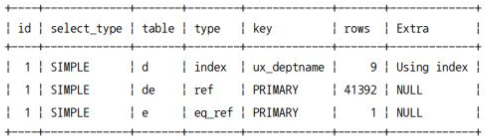
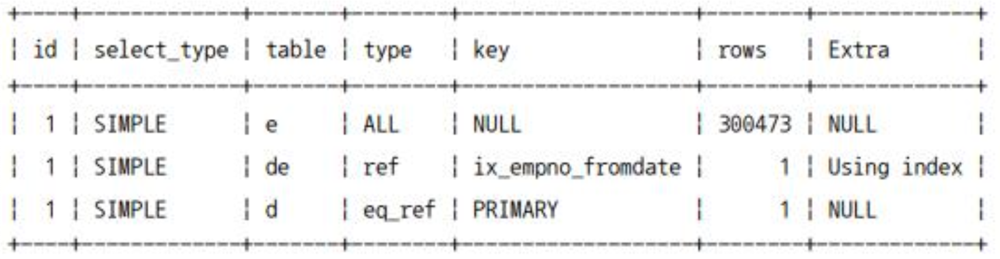
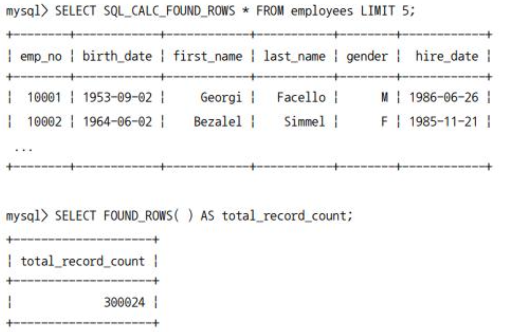
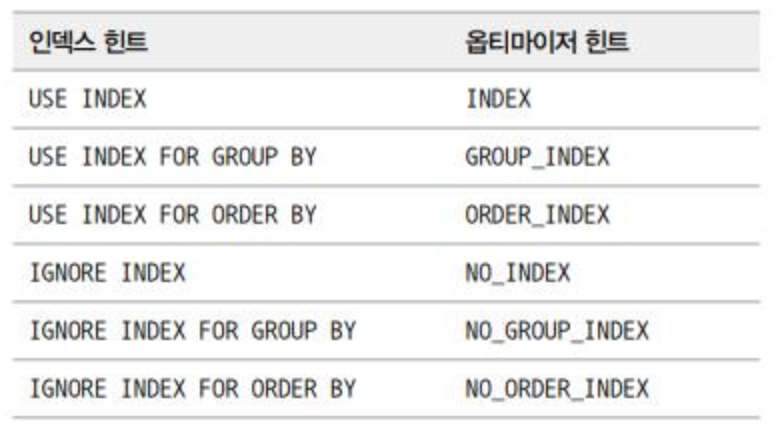

# 9.4 쿼리 힌트

MySQL 서버는 우리의 비즈니스를 전부 이해하지 못하기 때문에 때로는 부족한 실행 계획을 수립할 때가 있다. 이럴 때 서비스 개발자나 DBA가 **옵티마이저에게 쿼리의 실행 계획을 어떻게 수립해야 할 지 알려줄 수 있는 방법**이 필요하다.

이를 **쿼리 힌트**라고 하며 MySQL에서 사용 가능한 쿼리 힌트는 다음과 같이 2가지로 구분할 수 있다.

- 인덱스 힌트
- 옵티마이저 힌트

## 9.4.1 인덱스 힌트

`STRAIGHT_JOIN`과 `USE INDEX` 등을 포함한 인덱스 힌트들은 모두 MySQL 서버에 옵티마이저 힌트가 도입되기 전에 사용되던 기능들이다.

이들은 모두 SQL의 문법에 맞게 사용해야 하기 때문에 ANSI-SQL 표준 문법을 준수하지 못하게 된다.

반면, 옵티마이저 힌트 같은 경우는 주석으로 (수정 필요)

### 9.4.1.1 STARIGHT_JOIN

`STRAIGHT_JOIN`은 옵티마이저 힌트인 동시에 조인 키워드이기도 하다. `STRAIGHT_JOIN`은 **`SELECT`, `UPDATE`, `DELETE` 쿼리에서 여러 개의 테이블이 조인되는 경우 조인 순서를 고정하는 역할**을 한다.

```SQL
EXPLAIN
SELECT *
FROM employees e, dept_emp de, departments d
WHERE e.emp_no=de.emp_no AND d.dept_no=de.dept_no;
```

위의 쿼리를 실행하면 다음과 같은 실행 플랜을 얻을 수 있다.



`departments` 테이블을 드라이빙 테이블로 선택한 후, `dept_emp`와 `employees`를 순서대로 읽었음을 알 수 있다.

일반적으로 조인을 위한 칼럼들의 인덱스 여부로 조인 순서가 결정되며, 인덱스에 문제가 없다면 레코드가 적은 테이블이 드라이빙으로 선택된다.

조인 순서를 변경하려는 경우 `STRAIGHT_JOIN`을 사용할 수 있다.

```SQL
SELETE STRAIGHT_JOIN
    e.first_name, e.last_name, d.dept_name
FROM employees e, dept_emp de, departments d
WHERE e.emp_no=de.emp_no AND d.dept_no=de.dept_no;
```



`STRAIGHT_JOIN` 힌트는 옵티마이저가 **`FROM` 절에 명시된 테이블의 순서대로 조인을 수행하도록 유도**하는데, 이 쿼리의 실행 계획을 보면 `FROM` 절에 명시된 테이블의 순서대로 조인을 수행한다는 것을 알 수 있다.

주로 다음 기준에 맞게 조인 순서가 결정되지 않는 경우에만 `STRAIGHT_JOIN` 힌트로 조인 순서를 조정하는 것이 좋다.

- 임시 테이블(인라인 뷰 또는 파생된 테이블)과 일반 테이블의 조인
- 임시 테이블끼리 조인
- 일반 테이블끼리 조인

위에서 언급한 레코드 건수라는 것은 인덱스를 사용할 수 있는 `WHERE` 조건까지 포함해서 그 조건을 만족하는 레코드 건수를 의미하는 것이지, 테이블 전체의 레코드 건수를 의미하는 것은 아니다.

다음 예제와 같이 `employees` 테이블의 건수가 훨씬 많지만 조건을 만족하는 `employees` 테이블의 레코드는 건수가 훨씬 적은 경우를 생각해볼 수 있다. 이런 경우에는 `STRAIGHT_JOIN` 힌트를 이용해 `employees` 테이블을 드라이빙되게 하는 것이 좋다.

```SQL
SELECT /*! STARIGHT_JOIN */
    e.first_name, e.last_name, d.dept_name
FROM employees e, departments d, dept_emp de
WHERE e.emp_no=de.emp_no
    AND d.dept_no=de.dept_no
    AND e.emp_no=10001;
```

`STRAIGHT_JOIN` 힌트와 비슷한 역할을 하는 옵티마이저 힌트로는 다음과 같은 것들이 있다.

- `JOIN_FIXED_ORDER`
- `JOIN_ORDER`
- `JOIN_PREFIX`
- `JOIN_SUFFIX`

`JOIN_FIXED_ORDER` 옵티마이저 힌트는 `STRAIGHT_JOIN` 힌트와 동일한 효과를 낸다. 하지만 **나머지 3개의 힌트는 `STRAIGHT_JOIN`과는 달리 일부 테이블의 조인 순서에 대해서만 제안하는 힌트**이다.

### 9.4.1.2 USE INDEX / FORCE INDEX / IGNORE INDEX

조인의 순서를 변경하는 것 다음으로 자주 사용되는 인덱스 힌트이다. `STRAIGHT_JOIN` 힌트와는 달리 인덱스 힌트는 사용하려는 인덱스를 가지는 테이블 뒤에 힌트를 명시해야 한다. 대체로 옵티마이저는 어떤 인덱스를 사용해야 할지 무난하게 선택하는 편이다. 하지만 **3~4개 이상의 칼럼을 포함하는 비슷한 인덱스가 여러 개 존재하는 경우 가끔 옵티마이저가 실수를 하는데, 이런 경우에는 강제로 특정 인덱스를 사용하도록 힌트를 추가**한다.

인덱스 힌트에는 크게 3가지 종류가 있다.

- `USE INDEX`
  - 특정 테이블의 인덱스를 사용하도록 권장
- `FORCE INDEX`
  - `USE INDEX`와 다른 점이 없으며, `USE INDEX`를 사용해서 인덱스를 사용하지 않았다면 `FORCE INDEX`에서도 같은 결과일 것이다.
- `IGNORE INDEX`
  - 앞 선 두 힌트와는 다르게 인덱스를 사용하지 못하게 한다. 옵티마이저가 풀 테이블 스캔을 사용하도록 유도하기 위해 `IGNORE INDEX` 힌트를 사용할 수도 있다.

인덱스 힌트 모두 용도를 명시해 줄 수 있다.

- `USE INDEX FOR JOIN`
- `USE INDEX FOR ORDER BY`
- `USE INDEX FOR GROUP BY`

인덱스의 용도까지는 옵티마이저가 원래 **대부분의 상황에서 최적으로 선택하기에 크게 고려하지 않아도 된다**.

```sql
mysql> SELECT * FROM employees WHERE emp_no=10001;
mysql> SELECT * FROM employees FORCE INDEX(primary) WHERE emp_no=10001;
mysql> SELECT * FROM employees USE INDEX(primary) WHERE emp_no=10001;

mysql> SELECT * FROM employees IGNORE INDEX(primary) WHERE emp_no=10001;
mysql> SELECT * FROM employyes FORCE INDEX(ix_firstname) WHERE emp_no=10001;
```

첫 번째부터 세 번째 쿼리는 모두 PK를 활용하여 동일한 실행 계획으로 쿼리를 처리한다. 인덱스 힌트가 없어도 **`emp_no=10001`이라는 조건이 있기에 PK를 활용하는 것이 최적이라는 것을 옵티마이저도 인식**하기 때문이다.

네 번째는 얼토당토 없게도 인덱스를 활용하지 말라고 힌트를 던졌다. 옵티마이저가 해당 힌트를 무시할 것이라고 생각할 수도 있지만, 예전 버전에서는 PK 레인지 스캔을 마다하고 풀 테이블 스캔이 수립되기도 했다.

다섯 번째 예제 또한 전혀 관계 없는 인덱스를 사용하도록 `FORCE INDEX`를 줬더니 PK를 버리고 풀 테이블 스캔을 하는 형태로 실행 계획이 출력되었다.

> 인덱스 사용법이나 좋은 실행 계획이 어떤 것인지 판단하기 힘든 상황이라면 힌트를 사용해 강제로 옵티마이저의 실행 계획에 영향을 미치는 것은 피하는 것이 좋다.

### 9.4.1.3 SQL_CALC_FOUND_ROWS

MySQL의 `LIMIT`을 사용하는 경우, 조건을 만족하는 레코드가 `LIMIT`에 명시된 수보다 더 많다고 하더라도 `LIMIT`에 명시된 수만큼 만족하는 레코드를 찾으면 즉시 검색 작업을 멈춘다. 하지만 `SQL_CALC_FOUND_ROWS` 힌트가 포함된 쿼리의 경우에는 `LIMIT`을 만족하는 수만큼의 레코드를 찾았다고 하더라도 끝까지 검색을 수행한다. \*\*해당 힌트가 사용된 경우 `FOUND_ROWS()`라는 함수를 이용해 `LIMIT`을 제외한 조건을 만족하는 레코드가 전체 몇 건이었는지를 알아낼 수 있다.



**이 절에서는 해당 힌트를 사용하면 안되는 이유에 대해 설명하고자 한다.**

- **`SQL_CALC_FOUND_ROWS` 사용법**

```SQL
mysql> SELECT SQL_CALC_FOUND_ROWS * FROM employees WHERE first_name='Georgi' LIMIT 0, 20;
mysql> SELECT FOUND_ROWS() AS total_record_count;
```

- 이 경우에는 쿼리는 총 두 번 실행된다.
- `first_name='Georgi'` 조건을 처리하기 위해 `employees` 테이블의 `ix_firstname` 인덱스를 레인지 스캐능로 실제 값을 읽어오는데, 실제 이 조건을 만족하는 레코드는 전체 253건이다.
- `LIMIT` 조건이 20건만 가져오도록 했지만 `SQL_CALC_FOUND_ROWS` 힌트 때문에 조건을 만족하는 레코드를 전부 읽어야 하며, `ix_firstname` 인덱스를 통해 실제 데이터 레코드를 찾아가는 작업을 253번 실행해야 한다. **즉, 랜덤 I/O가 253번 발생**한다.

- **기존 2개의 쿼리로 쪼개어 실행하는 방법**

```SQL
mysql> SELECT COUNT(*) FROM employees WHERE first_name='Georgi';
mysql> SELECT * FROM employees WHERE first_name='Georgi' LIMIT 0, 20;
```

- 이 방식 또한 쿼리는 2번 실행된다.
- 첫 번째 쿼리 또한 `ix_firstname` 인덱스를 레인지 스캔한다. 하지만, 실제 레코드가 필요하지 않은 **커버링 인덱스 쿼리** 이기 때문에 랜덤 I/O는 발생하지 않는다.
- 두 번째 쿼리는 `ix_firstname` 인덱스를 통해 레인지 스캔을 수행한다. 이 때 실제 데이터 레코드를 가져오기 위해 랜덤 I/O가 발생하는데, `LIMIT` 조건에 의해 20번의 랜덤 I/O만 발생한다.

위의 분석을 통해 무엇이 더 성능적으로 유리한지 쉽게 알 수 있다. **`SQL_CALC_FOUND_ROWS` 힌트의 경우 성능 향상을 위해 만들어진 힌트가 아닌 개발자의 편의를 위해 만들어진 힌트**라는 것을 항상 생각하자.

## 9.4.2 옵티마이저 힌트

### 9.4.2.1 옵티마이저 힌트 종류

- 인덱스: 특정 인덱스의 이름을 사용할 수 있는 옵티마이저 힌트
- 테이블: 특정 테이블의 이름을 사용할 수 있는 옵티마이저 힌트
- 쿼리 블록: 특정 쿼리 블록에 사용할 수 있는 옵티마이저 힌트로서, 특정 쿼리 블록의 이름을 명시하는 것이 아니라 힌트가 명시된 쿼리 블록에 대해서만 영향을 미치는 옵티마이저 힌트
- 글로벌(쿼리 전체): 전체 쿼리에 대해서 영향을 미치는 힌트

하나의 SQL 문장에서 `SELECT` 키워드는 여러 번 사용될 수 있다. 이 때 각 `SELECT` 키워드로 시작하는 서브쿼리 영역을 쿼리 블록이라고 한다. 특정 쿼리 블록에 영향을 미치는 옵티마이저 힌트는 그 쿼리 블록 내에서 사용될 수도 있지만 외부 쿼리 블록에서 사용할 수도 있다.

이처럼 특정 쿼리 블록을 외부 쿼리 블록에서 사용하려면 `QB_NAME()` 힌트를 이용해 해당 쿼리 블록에 이름을 부여해야 한다.

### 9.4.2.2 MAX_EXECUTION_TIME

쿼리의 최대 실행 시간을 설정하는 힌트이다. `MAX_EXECUTION_TIME` 힌트에는 밀리초 단위의 시간을 설정하는데, 쿼리가 지정된 시간을 초과하면 다음과 같이 쿼리는 실패하게 된다.


### 9.4.2.3 SET_VAR

옵티마이저 힌트뿐만 아니라 **MySQL 서버의 시스템 변수들 또한 쿼리의 실행 계획에 상당한 영향**을 미친다.

대표적으로 조인 버퍼의 크기를 설정하는 `join_buffer_size` 시스템 변수의 경우 쿼리에 아무런 영향을 미치지 않을 것처럼 보이지만, MySQL 서버의 옵티마이저는 조인 버퍼의 공간이 충분하면 조인 버퍼를 활용하는 형태의 실행 계획을 선택할 수도 있다.

```SQL
EXPLAIN
SELECT /*+ SET_VAR(optimizer_switch='index_merge_intersection=off') */ *
FROM employees
WHERE first_name='Georgi' AND emp_no BETWEEN 10000 AND 20000;
```

`SET_VAR` 힌트는 실행 계획을 바꾸는 용도뿐만 아니라 조인 버퍼나 정렬용 버퍼의 크기를 일시적으로 증가시켜 대용량 처리 쿼리의 성능을 향상시키는 용도로도 사용할 수 있다.

### 9.4.2.4 SEMIJOIN & NO_SEMIJOIN

뭔소린지 모르겠는데?

### 9.4.2.5 SUBQUERY

서브 쿼리 최적화는 세마이 조인 최적화가 사용되지 못할 때 사용하는 최적화 방법으로, 서브 쿼리는 다음 2가지 형태로 최적화할 수 있다.

- IN-to-EXISTS: `SUBQUERY(INTOEXISTS)`
- Materialization: `SUBQUERY(MATERIALIZATION)`

세마이 조인 최적화는 주로 `IN(subquery)` 형태의 쿼리에 사용될 수 있지만 안티 세마이 조인의 최적화에는 사용될 수 없다. 그래서 주로 안티 세마이 조인 최적화에는 위의 2가지 최적화가 사용된다. 서브쿼리 최적화 힌트는 세마이 조인 최적화 힌트와 비슷한 형태로, 서브쿼리에 힌트를 사용하거나 서브쿼리에 쿼리 블록 이름을 지정하여 외부 쿼리 블록에서 최적화 방법을 명시하면 된다.

### 9.4.2.6 BNL & NO_BNL \* HASHJOIN & NO_HASHJOIN

BNL 힌트를 사용하면 해시 조인을 사용하도록 유도하는 힌트로 용도가 변경되었다. 대신 `HASHJOIN`과 `NO_HASHJOIN` 힌트는 8.0.18 이후의 버전부터는 효력이 없다. 그래서 8.0.20과 그 이후 버전에서는 해시 조인을 유도하거나 해시 조인을 사용하지 않게 하고자 한다면 다음 예제 쿼리와 같이 `BNL`과 `NO_BNL` 힌트를 사용해야 한다.

```SQL
EXPLAIN
SELECT /*+ BNL(e, de) */ *
FROM employees e
INNER JOIN dept_emp de ON de.emp_no=e.emp_no;
```

> MySQL 서버에서는 조인 조건이 되는 칼럼의 인덱스가 적절히 준비되어 있으면 해시 조인은 거의 사용되지 않는다.

### 9.4.2.7 JOIN_FIXED_ORDER & JOIN_ORDER & JOIN_PREFIX & JOIN_SUFFIX

MySQL 서버에서는 조인의 순서를 결정하기 위해 전통적으로 `STRAIGHT_JOIN` 힌트를 사용해왔다. 하지만 `STRAIGHT_JOIN` 힌트는 우선 쿼리의 `FROM` 절에 사용된 테이블의 순서를 조인 순서에 맞게 변경해야 하는 번거로움이 있었다. 또한 `STRAIGHT_JOIN`은 한 번 사용되면 모든 테이블의 조인 순서가 결정되기에 일부는 조인 순서를 강제하고 나머지는 옵티마이저에게 순서를 결정하게 맡기는 것이 불가능했다. 이 같은 단점을 보완하기 위해 옵티마이저 힌트는 `STRAIGHT_JOIN`과 동일한 힌트를 포함하여 다음과 같은 4개의 힌트를 제공한다.

- **JOIN_FIXED_ORDER**: `STRAIGHT_JOIN`과 동일

```SQL
SELECT /*+ JOIN_FIXED_ORDER() */ *
FROM employees e
    INNER JOIN dept_emp de ON de.emp_no=e.emp_no
    INNER JOIN departments d ON d.dept_no=de.dept_no;
```

- **JOIN_ORDER**: `FROM`절에 사용된 테이블의 순서가 아니라 힌트에 명시된 테이블의 순서대로 조인을 실행하는 힌트

```SQL
SELECT /*+ JOIN_ORDER(d, de) */ *
FROM employees e
    INNER JOIN dept_emp de ON de.emp_noze. emp_no
    INNER JOIN departments d ON d. dept_no=de.dept_no;
```

- **JOIN_PREFIX**: 조인에서 드라이빙 테이블만 강제하는 힌트

```SQL
SELECT /** JOIN_ PREFIX(e, de) */ *
FROM employees e
    INNER JOIN dept_emp de ON de. emp_no=e. emp_no
    INNER JOIN departments d ON d.dept_no=de.dept_no;
```

- **JOIN_SUFFIX**: 조인에서 드리븐 테이블(가장 마지막에 조인돼야 할 테이블들)만 강제하는 힌트

```SQL
SELECT /** JOIN_ PREFIX(e, de) */ *
FROM employees e
    INNER JOIN dept_emp de ON de. emp_no=e. emp_no
    INNER JOIN departments d ON d.dept_no=de.dept_no;
```

### 9.4.2.8 MERGE & NO_MERGE

예전 MySQL은 `FROM`절에 사용된 서브쿼리를 항상 내부 임시 테이블로 생성했다. 이렇게 생성된 내부 임시 테이블을 파생 테이블(Derived table)이라고 하는데, 이는 **불필요한 자원 소모를 유발**한다.

MySQL 5.7과 8.0 버전에서는 가능하면 임시 테이블을 사용하지 않게 `FROM` 절의 서브쿼리를 외부 쿼리와 병합하는 최적화를 도입했다. 때로는 옵티마이저가 내부 쿼리를 외부 쿼리와 병합하는 것이 나을 수도 있고, 때로는 내부 임시 테이블을 생성하는 것이 더 나은 선택일 수도 있다. 하지만, 옵티마이저는 최적의 방법을 선택하지 못할 수도 있는데, 이 때는 다음과 같이 `MERGE` 또는 `NO_MERGE` 옵티마이저 힌트를 사용하면 된다.

### 9.4.2.9 INDEX_MERGE & NO_INDEX_MERGE

**하나의 테이블에 대해 여러 개의 인덱스를 동시에 사용하는 것을 인덱스 머지**라고 한다. 인덱스 머지 실행 계획은 성능 향상에 도움이 되지만 항상 그렇지는 않다. 인덱스 머지 실행 계획의 사용 여부를 제어하고자 할 때, 다음 예제와 같이 `INDEX_MERGE`와 `NO_INDEX_MERGE` 옵티마이저 힌트를 사용하면 된다.

### 9.4.2.10 NO_ICP

> **Index Condition Pushdown(ICP)** 는 MySQL 옵티마이저의 실행 계획 최적화 기법 중 하나로, 보조 인덱스를 이용한 범위 스캔(range scan) 또는 인덱스 풀 스캔(index full scan) 시 WHERE 절의 조건식을 스토리지 엔진(InnoDB 등)으로 “푸시다운(push down)“하여, 스토리지 엔진이 가능한 많은 조건을 인덱스 스캔 중에 평가할 수 있도록 허용하는 최적화 기법이다.

해당 최적화 기법을 비활성화하는 힌트이다.

### 9.4.2.11 SKIP_SCAN & NO_SKIP_SCAN

유니크한 값이 늘어난다면, 인덱스 스킵 스캔의 성능이 떨어진다. 이럴 때 `NO_SKIP_SCAN` 힌트를 이용해 인덱스 스킵 스캔을 사용하지 않게할 수 있다.

### 9.4.2.12 INDEX & NO_INDEX

예전 MySQL 서버에서 사용하던 인덱스 힌트를 대체하는 용도로 제공되는 힌트이다.

